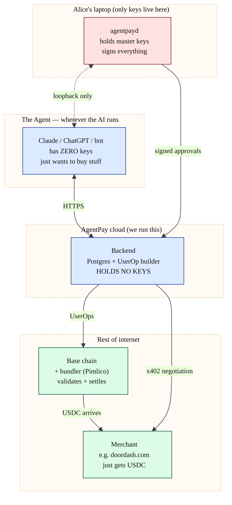

Step 1 — The cast of four characters
Think of AgentPay as a play with four actors, each living in a different place:


```
┌────────────────────────────────────────────────────────────────────────┐
│  ALICE'S LAPTOP (the only place that holds keys)                       │
│  ┌────────────────────────┐                                            │
│  │  agentpayd (daemon)    │ ◀── holds Alice's master keys              │
│  │  - Ed25519 master      │     (Ed25519 for signing approvals,        │
│  │  - secp256k1 master    │      secp256k1 for the on-chain wallet)    │
│  │  - HKDF salt           │                                            │
│  │  Listens on            │     Pops up the "approve?" prompt.         │
│  │  localhost:8087        │     Signs PolicyWindows + UserOps.         │
│  └────────────────────────┘                                            │
└────────────────────────────────────────────────────────────────────────┘
                  ▲   ▲
                  │   │
                  │   └─── (loopback HTTP only)
                  │
┌─────────────────┴───────────┐    ┌──────────────────────────────────┐
│  THE AGENT                  │    │  AGENTPAY BACKEND                │
│  (Claude / ChatGPT / a bot) │    │  (a cloud service we operate)    │
│                             │    │                                  │
│  - Lives wherever the AI    │    │  - Postgres of policies, users   │
│    lives (cloud or local)   │    │  - Builds UserOps                │
│  - Wants to spend money     │    │  - Talks to merchant + chain     │
│    on Alice's behalf        │    │  - HOLDS NO SIGNING KEYS         │
│  - Has zero authority       │    │                                  │
│  - Holds nothing            │    │                                  │
└─────────────────────────────┘    └──────────────────────────────────┘
                                              │       │
                                              ▼       ▼
                              ┌────────────────┐  ┌───────────────────┐
                              │ MERCHANT       │  │ THE CHAIN         │
                              │ (e.g.          │  │ (Base / Ethereum) │
                              │  doordash.com) │  │ + a bundler       │
                              │                │  │   (Pimlico)       │
                              │ Just receives  │  │                   │
                              │ USDC.          │  │ Checks            │
                              │ Doesn't know   │  │ signatures,       │
                              │ AgentPay       │  │ moves USDC        │
                              │ exists.        │  │                   │
                              └────────────────┘  └───────────────────┘
```



The single most important property: only the daemon has keys. Backend, agent, merchant — all keyless. The whole architecture is built around that.

## Step 2 — One concrete purchase, end-to-end

### Scenario: Alice opens Claude on her laptop and says "Order me a $20 burrito from DoorDash."

```
SCENE: Alice's laptop. agentpayd is running in the menu bar.
       Claude (the agent) is open in a browser tab.

╭── ① Agent forms an intent ─────────────────────────────────────╮
│                                                                 │
│  Claude figures out: "user wants to call doordash.com's API,    │
│   buy burrito #234, costs $20 USDC."                            │
│                                                                 │
│  Claude → AgentPay backend:                                     │
│    "Hey backend, I need to spend up to $20 USDC at              │
│     doordash.com. Please draft a policy."                       │
╰─────────────────────────────────────────────────────────────────╯
                              ▼
╭── ② Backend drafts a PolicyWindow ─────────────────────────────╮
│                                                                 │
│  Backend assembles a JSON object (NOT signed yet):              │
│    {                                                            │
│      iss: "agentpayd://agentpay/<alice-laptop-uuid>",                 │
│      sub: "user_alice123",                                      │
│      policy: {                                                  │
│        merchant: { host: "doordash.com", wallet: "0x9aE..." },  │
│        amount:   { max: "20000000", decimals: 6 },              │
│        valid_until: now + 5min,                                 │
│        ...                                                      │
│      }                                                          │
│    }                                                            │
│                                                                 │
│  Backend → Claude: "Here's the draft. Send to the daemon."      │
╰─────────────────────────────────────────────────────────────────╯
                              ▼
╭── ③ Claude hands it to the daemon ──────────────────────────────╮
│                                                                 │
│  Claude POSTs the draft to localhost:8087/v1/policy/sign        │
│  (the daemon refuses any non-loopback request).                 │
│                                                                 │
│  No keys involved yet. Claude is just a courier.                │
╰─────────────────────────────────────────────────────────────────╯
                              ▼
╭── ④ Daemon prompts Alice ───────────────────────────────────────╮
│                                                                 │
│  ┌──────────────────────────────────────┐                        │
│  │  ⚡ Approve spend?                   │                        │
│  │                                      │                        │
│  │  Merchant:  doordash.com             │                        │
│  │  Amount:    up to 20.00 USDC         │                        │
│  │  Valid for: 5 minutes                │                        │
│  │  Reason:    Order burrito #234       │                        │
│  │                                      │                        │
│  │  [Approve]   [Deny]                  │                        │
│  └──────────────────────────────────────┘                        │
│                                                                 │
│  Alice clicks Approve.                                          │
╰─────────────────────────────────────────────────────────────────╯
                              ▼
╭── ⑤ Daemon signs (THIS is the JWS) ─────────────────────────────╮
│                                                                 │
│  The daemon takes the JSON, computes Ed25519 signature over     │
│  it, glues them together, returns to Claude:                    │
│                                                                 │
│    eyJhbGc...HEADER...   ← base64url(JSON header)               │
│    eyJpc3M...PAYLOAD...  ← base64url(the policy JSON)           │
│    Xm3Ks...SIGNATURE...  ← base64url(Ed25519 signature)         │
│                                                                 │
│  Joined with dots:                                              │
│    "eyJhbGc...HEADER....eyJpc3M...PAYLOAD....Xm3Ks...SIG..."    │
│                                                                 │
│  THIS THREE-PART STRING IS A "JWS." Just a signed JSON blob.    │
╰─────────────────────────────────────────────────────────────────╯
                              ▼
╭── ⑥ Signed JWS goes back to backend ────────────────────────────╮
│                                                                 │
│  Claude POSTs it back to backend:                               │
│    "Here's the signed policy. The user approved."               │
│                                                                 │
│  Backend verifies:                                              │
│    - Ed25519 signature matches Alice's registered master pubkey │
│    - jti not seen before (replay defense)                       │
│    - Schema valid, time bounds sane, etc.                       │
│                                                                 │
│  Backend stores it in Postgres. This JWS is the receipt of      │
│  Alice's approval.                                              │
╰─────────────────────────────────────────────────────────────────╯
                              ▼
╭── ⑦ Backend installs the session key on chain ──────────────────╮
│                                                                 │
│  Backend builds a UserOp that calls the validator's             │
│  enableSessionKey(...). Asks the daemon to sudo-sign it with    │
│  the secp256k1 master. Submits to bundler. Chain registers      │
│  the session-key constraints.                                   │
│                                                                 │
│  At this point, on-chain state says:                            │
│    "session key 0xCAFE... can spend up to 20 USDC               │
│     to wallet 0x9aE... before T+5min"                           │
╰─────────────────────────────────────────────────────────────────╯
                              ▼
╭── ⑧ Claude calls DoorDash, gets a 402 ──────────────────────────╮
│                                                                 │
│  Claude → doordash.com: "I want burrito #234"                   │
│  DoorDash → Claude:    "402 Payment Required: pay $20 USDC      │
│                          to 0x9aE... using EIP-3009"            │
╰─────────────────────────────────────────────────────────────────╯
                              ▼
╭── ⑨ Backend builds the spend UserOp; daemon signs it──────────────╮
│                                                                   │
│  Claude → backend:   "DoorDash demands payment, here's the 402"   │
│  Backend builds the UserOp.                                       │
│  Backend → daemon:    "Sign this UserOp under policy plc_alice"   │
│  Daemon: re-derives the SESSION key (not master), signs hash.     │
│  Backend → bundler:   submits the signed UserOp.                  │
│  Chain validator:     "yes, signature matches, USDC moves."       │
╰───────────────────────────────────────────────────────────────────╯
                              ▼
╭── ⑩ DoorDash sees USDC arrive ──────────────────────────────────╮
│                                                                 │
│  DoorDash's wallet (0x9aE...) gets a $20 USDC transfer event.   │
│  DoorDash's webhook fires. They ship the burrito.               │
│                                                                 │
│  DOORDASH HAS NEVER SEEN THE POLICY OR THE JWS. They saw an     │
│  on-chain transfer. That's it.                                  │
╰─────────────────────────────────────────────────────────────────╯
```

That's a complete purchase. Eight characters were involved; only Alice's laptop ever held a key.

## Step 3 — So what IS this "backend" thing?

The backend is a cloud service AgentPay (us) operates. Like Stripe runs api.stripe.com, AgentPay runs api.agentpay.dev. It's a NestJS server with a Postgres database.

It is separate from the daemon. Different machine, different operator, different code:

**Why is the backend keyless?** Because if the backend held a key, an AgentPay employee or a hacker who breached AgentPay's cloud could drain user funds. By construction we made that impossible. The backend is plumbing — it builds UserOps, talks to merchants, runs the database — but it cannot authorize a payment without going to the user's daemon.
Why have a backend at all then? Why not put everything on the laptop?

 1. Merchants need a stable URL. When DoorDash gets paid, they may want a webhook callback. They need to talk to something that's always online. The user's laptop is sometimes asleep. The backend is always
    online.
 2. Coordination. Building UserOps right requires up-to-date gas estimates, paymaster sponsorship, bundler routing. Doing this in the daemon means every laptop reimplements the protocol — fragile. The 
    backend does it once.
 3. Audit + recovery. If Alice loses her laptop, the backend has the history of what was approved. Useful for the recovery flow.
 4. x402 facilitation. When an agent calls a merchant API and gets a 402, the response goes through the backend, which translates it into a structured intent before talking to the daemon.

The backend is the secretary. It schedules things, drafts memos, files paperwork. But every actual decision (every signature) goes back to the boss (the daemon).


